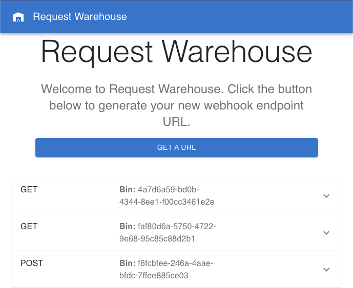

# request_warehouse
request warehouse is a webhook monitoring, debugging and storage solution. Request warehouse issues webhook URLs and allows users to monitor and keep track of all requests sent to that URL

# installation

1. `git clone` the repo
2. move to the "backend" folder
3. run `node index.js` to run the production build and backend server

# usage

1. click "get a URL" button to generate a new webhook url
2. issue any http requests to that url
3. reload the page to see an updated list of the requests
